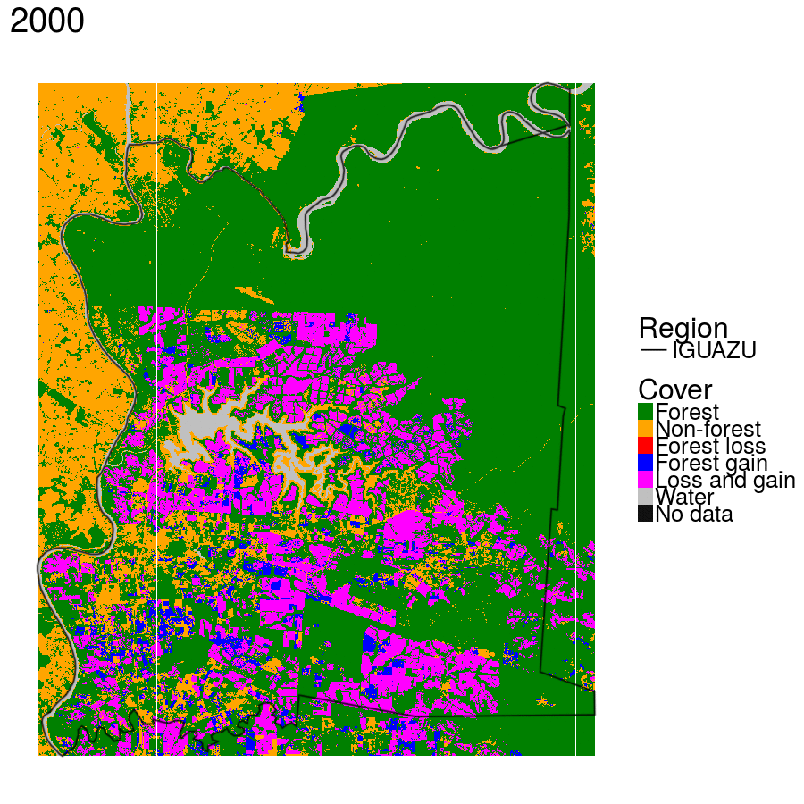
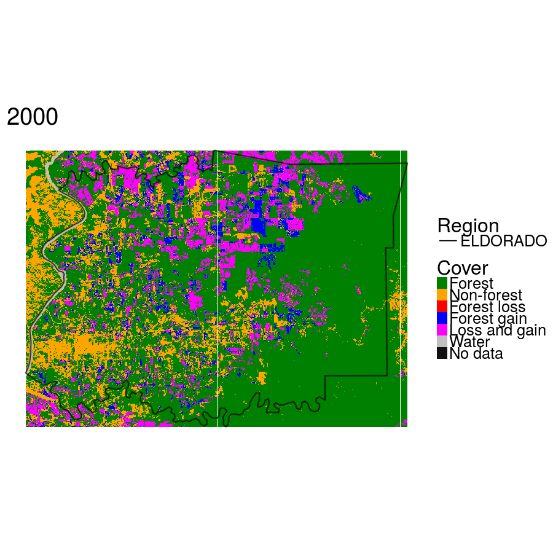
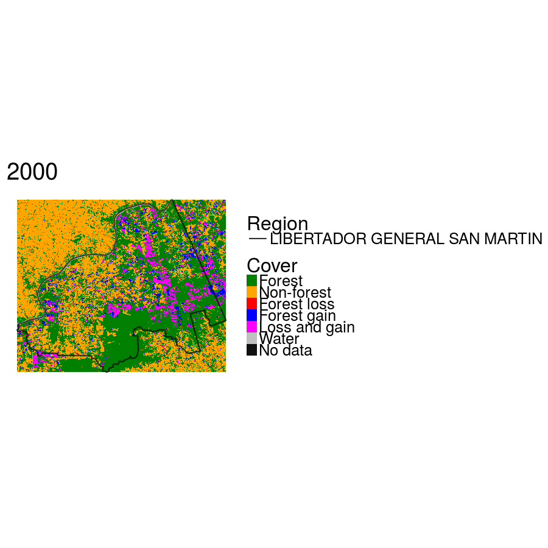
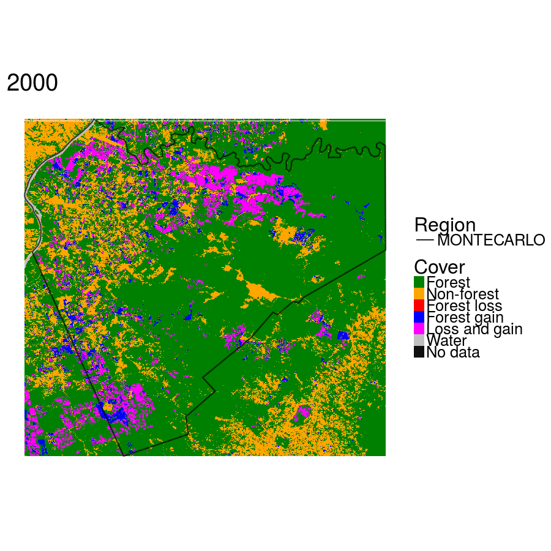
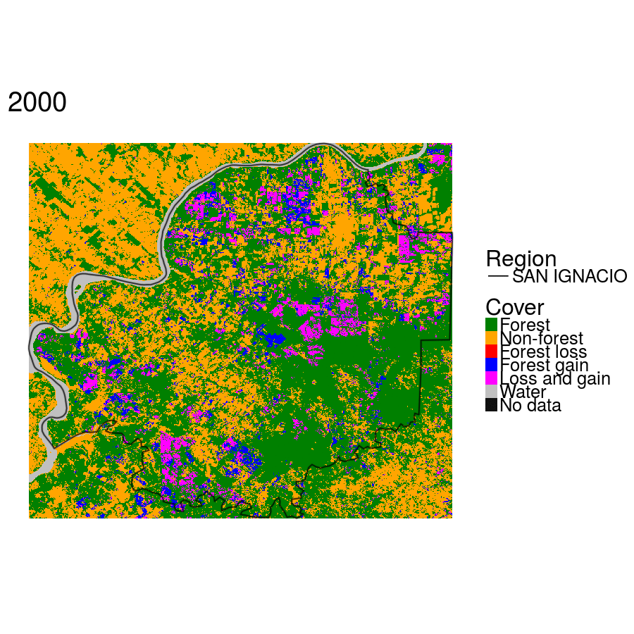

# Día internacional del Medio Ambiente  
Por el día internacional del medio ambiente, busqué los datos de cambio forestal mundial (Hansen, 2015) y los analisé para la provincia de Misiones, Argentina, estimando para cada departamento la taza de deforestación.

És importante observar que: **1) no se puede decir que el cambio de cobertura forestal (deforestación) estés recionado a la deforestación de vegetación nativa**; 2) estamos analisando una área con produción de Pinus; 3) las análisis presentadas no presentan rigor científico; Pero creemos ser un buen início en relación al monitoreo forestal.

### Los datos:
De todos los departamentos, apenas presentaremos aquellos con mayor taza: ELDORADO, IGUAZU, LIBERTADOR GENERAL SAN MARTIN, MONTECARLO, SAN IGNACIO;
  
  
  
  
