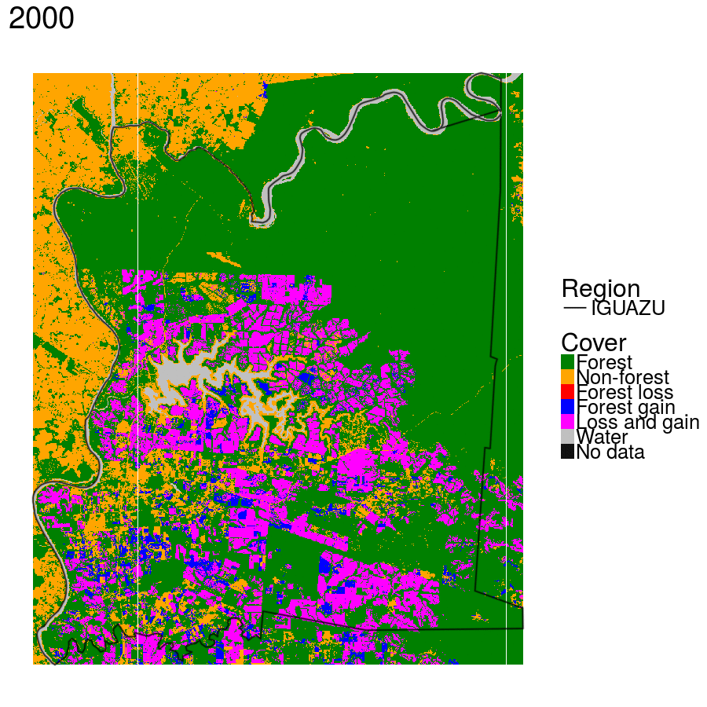
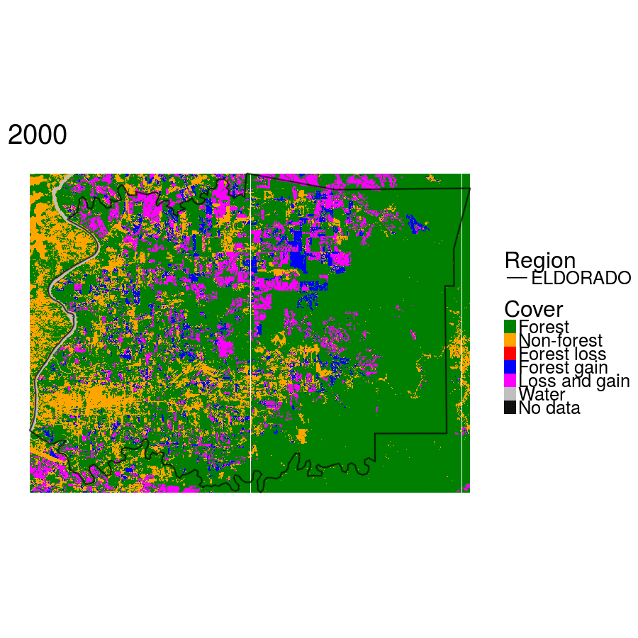
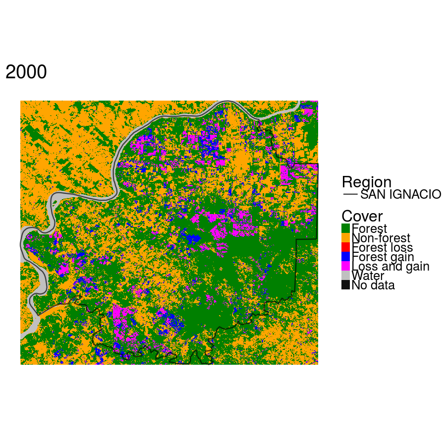

# Día internacional del Medio Ambiente  2017  

Por el día internacional del medio ambiente, busqué los datos de cambio forestal mundial (Hansen, 2013) y los analicé para la provincia de Misiones, Argentina, estimando para cada departamento la tasa de deforestación.

Es importante observar que: **1) no se puede decir que el cambio de cobertura forestal (deforestación) esté relacionado a la deforestación de vegetación nativa**; 2) estamos analizando un área con grande produción de Pino; 3) los análisis presentadas fueron hechas en un día y pueden contener errores; Pero creemos ser un buen início en relación al monitoreo forestal.

### Los datos:  

Los datos fueron analizados de 2001 hasta 2013 y son clasificados en:  
  
+ *Forest* = Áreas de floresta (como observado anteriomente, no necesariamente vegetación nativa) que se mantuvieron forestadas durante todo período de análisis;  
+ *Non-forest* = Área con otras coberturas non-forestales;  
+ *Forest loss* = Área donde hubo perdida de cobertura forestal en algun de los año analizados;    
+ *Forest gain* = Áreas donde hubo ganancia de cobertura forestal  en algun de los años analizados;  
+ *Loss and gain* = Áreas donde hubo ganancia Y perida de cobertura forestal (generalmente áreas de plantio de pinus) en algun de los años analizados;   

Con relación a las áreas donde hubo ganancia y pérdida forestal, es muy probable que sean áreas de plantación de Pino.

De todos los departamentos, apenas presentaremos aquellos con mayor tasa de converción forestal: ELDORADO, IGUAZÚ, MONTECARLO, SAN IGNACIO;  


```{r setup, echo=FALSE, message=FALSE, error=FALSE, warning=FALSE}
library(ggplot2)
library(plotly)
library(data.table)
library(pander)

Tax <- read.csv("Tax.csv", check.names = F)
Tax <- melt(Tax, id.vars="Departamentos", measure.vars=c(colnames(Tax)[1:13]), variable.name="year", value.name="Tasa_Deforestación")
Tax <- Tax[-(1:17),]
Tax <- Tax[grep(paste(c("MONTECARLO","IGUAZU","SAN IGNACIO", "ELDORADO"), collapse = "|"), Tax$Departamentos),]

ggplot(Tax, aes(x=year, y=Tasa_Deforestación, group=Departamentos, colour=Departamentos)) + geom_line()
```
  
Los datos de tasa de deforestación fueron calculados a partir de los valores absolutos en hectarea:
```{r, echo=FALSE, message=FALSE, error=FALSE, warning=FALSE}
Def <- read.csv("Deforestation_Misiones_Result.csv", check.names = FALSE)
#head(Def)
Def<- Def[grep(paste(c("MONTECARLO","IGUAZU","SAN IGNACIO", "ELDORADO"), collapse = "|"), Def$Departamento),]
row.names(Def) <- NULL
pander(Def)
```

Además de datos de deforestación, se puede observar como fué el cambio por años a cada uno de los departamentos:

```{r, out.width = "600px", echo=FALSE, message=FALSE, error=FALSE, warning=FALSE}

```
```{r, out.width = "700px", echo=FALSE, message=FALSE, error=FALSE, warning=FALSE}

```
```{r, out.width = "700px", echo=FALSE, message=FALSE, error=FALSE, warning=FALSE}
knitr::include_graphics("./gif/gfc_animationmontecarlo .gif")
```
```{r, out.width = "700px", echo=FALSE, message=FALSE, error=FALSE, warning=FALSE}

```

## Referencia:  

Hansen, M. C., P. V. Potapov, R. Moore, M. Hancher, S. A. Turubanova, A. Tyukavina, D. Thau, S. V. Stehman, S. J. Goetz, T. R. Loveland, A. Kommareddy, A. Egorov, L. Chini, C. O. Justice, and J. R. G. Townshend. 2013. **“High-Resolution Global Maps of 21st-Century Forest Cover Change.”** Science 342 (15 November): 850–53. Data available on-line from: http://earthenginepartners.appspot.com/science-2013-global-forest. 